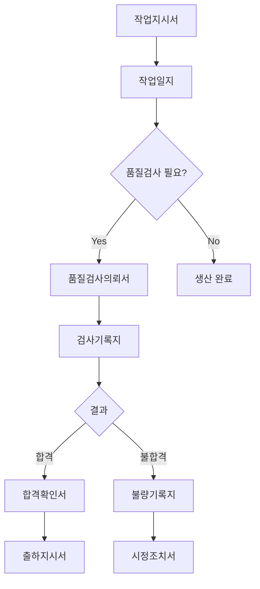

# 워크숍 가이드

반나절(휴식 포함 3시간 20분)의 집중 협업 세션으로, 현업과 개발팀이 함께 문서 목록을 도출하고 시스템 설계의 기초를 마련한다.

> 용어 정본: [구현 원리 — 용어 사전](realization.md#8-용어-사전). `FormType(서식) / Form(양식) / Document(문서) / Record(레코드)`

**워크숍 목표**:
- 15~30개 문서(서식) 목록 도출
- 주요 문서 양식 스케치 (3~5개)
- 문서 간 흐름도 작성 (**선행 조건 포함**)
- 데이터 관계(ERD) 초안
- MVP 우선순위 합의

---

## 0. 이 절차가 성립하는 조건

반나절이라는 시간은 조건 없이 나오지 않습니다. 아래를 벗어나면 절차를 다시 설계해야 합니다.

**성립 조건**:

| 조건 | 값 |
|------|-----|
| 대상 | **1개 업무 도메인** (품질검사, 구매 요청 등) |
| 서식 수 | 20~40개 |
| 참석 | 5~10명 |
| 결정권 | **해당 업무의 최종 승인자가 그 자리에 있을 것** |

마지막 조건이 가장 중요합니다. 승인자가 빠지면 산출물이 나중에 뒤집힙니다. 그러면 반나절이 아니라 두 번의 반나절이 듭니다.

**성립하지 않는 경우**:

- **다부서 통합** — 부서마다 같은 업무에 다른 서식을 쓰고 있고, 어느 쪽이 표준인지 정해지지 않은 상태
- **서식 수백 개** — 전사 규모, 여러 도메인이 얽힌 경우
- **서식 소유권 분쟁** — "이건 우리 양식인데요"가 나오는 상황

이 경우 **도메인별로 워크숍을 반복한 뒤 통합 세션을 따로** 여는 방식이 됩니다. 다만 정직하게 적습니다 — **이 확장 절차는 아직 충분히 검증되지 않았습니다.** 아래 본문이 기술하는 것은 단일 도메인 절차이며, 실측 사례([구현 원리 6장](realization.md#6-사례-연구))도 단일 도메인입니다.

---

## 1. 준비

### 1.1 참석자 선정

#### 필수 참석자

**현업 (3~5명)** — 역할 다양성 확보:
- 관리자 1명 (의사결정권자)
- 실무자 2~3명 (다양한 직무)
- 현장 담당자 1명 (실제 사용자)

> 예시 (제조 MES): 생산 관리자, 품질 담당자, 현장 반장, 자재 담당자

**개발팀 (1~2명)**:
- 진행자 1명 — 퍼실리테이션 경험, 현업 언어 존중
- 기록자 1명 — 빠른 타이핑, 구조화 능력, 질문 능력

**최적 구성**: 현업 실무자 3명 + 관리자 1명, BA 1명 + 개발자 1명, 진행자 1명

#### 피해야 할 구성

| 상황 | 문제 |
|------|------|
| 현업 1명만 | 한 사람의 관점만 반영, 다양성 부족 |
| 개발자만 5명 | 현업 의견 묻힘, 기술 용어 난무 |
| 경영진 참석 | 현업이 솔직한 의견 못 냄, 정치적 발언 증가 |

### 1.2 장소

- 회의실 크기: 6~8인용 (반나절 점유 — 3시간 30분 예약)
- 화이트보드: 최소 2개 (큰 것)
- 조명: 밝고 쾌적
- 소음: 조용함 (집중 필요)
- 환기: 3시간 이상 집중 가능
- 인터넷: 필요 없음 (집중 방해)

### 1.3 준비물

**필수**:
- 화이트보드 2개 이상
- 포스트잇 (5색, 각 100장)
  - 노란색: 요청/의뢰 문서
  - 파란색: 기록 문서
  - 초록색: 보고/확인 문서
  - 주황색: 표/현황 문서
  - 분홍색: 기타
- 마커펜 (굵은 것, 5색)
- 카메라/휴대폰 (기록용)
- A4 용지 (양식 스케치용, 30장)

**선택**:
- 간식 (쿠키, 과일), 음료 (커피, 차, 물)
- 타이머 (시간 관리용)
- 노트북 (실시간 기록용)

### 1.4 사전 공지 (1주 전)

참석자에게 아래 내용을 안내한다:

- 일시, 장소, 참석자, 목적 (업무 문서 목록 도출 및 양식 정의)
- **준비사항**: 현재 사용 중인 문서 양식 (종이, Excel 등) 가져오기
- 특별한 IT 지식은 불필요
- 진행 방식: 실제로 사용하는 "문서"를 나열 → 양식을 간단히 스케치 → 문서 간 흐름 정리

> "Entity, Domain Model 등 어려운 용어는 사용하지 않습니다. 여러분의 업무 용어 그대로 사용합니다."

### 1.5 리스크 및 대응

#### 시간 초과

**증상**: 브레인스토밍에서 1시간 소요, 문서가 50개 이상 나옴

**대응**:
1. 타이머 사용 (각 단계별 제한)
2. "일단 다 적고, 나중에 우선순위 정하겠습니다"
3. 핵심 문서만 양식 스케치, 나머지는 다음 세션으로

#### 기술 용어 난무

**증상**: 개발자가 "이건 Aggregate Root인데..." → 현업 이해 불가

**대응**:
1. 즉시 중단: "잠깐만요"
2. 현업 언어로 번역 요청
3. 규칙 재확인: "오늘은 현장 언어만 사용합니다"

#### 의견 충돌

**증상**: "이건 작업지시서예요" vs "아니요, 생산계획서죠"

**대응**:
1. 둘 다 기록: "네, 일단 둘 다 적겠습니다"
2. 차이 명확화: "두 문서의 차이가 뭔가요?"
3. 필요시 둘 다 시스템에 반영
4. 판단 유보: "개발하면서 정하겠습니다"

#### 침묵

**증상**: 아무도 말을 안 함, 30초 이상 정적

**대응**:
1. 구체적 질문: "아침에 출근하면 제일 먼저 뭐 하세요?", "어제 어떤 문서 작성하셨어요?"
2. 한 명씩 지목: "김과장님, 평소에 어떤 양식 쓰세요?"
3. 예시 제공: "다른 공장에서는 작업지시서 쓰던데, 여기도 비슷한 거 있나요?"

#### 완벽주의

**증상**: "이 필드가 정확히 뭔지 정해야...", "모든 경우의 수를 고려해야..."

**대응**:
1. 진행 우선: "일단 대략적으로만 정하고, 나중에 상세화하겠습니다"
2. MVP 강조: "완벽하지 않아도 괜찮습니다. 80%만 맞으면 됩니다"
3. 진화 가능성: "개발하면서 수정할 수 있습니다"

#### 추상적 답변

**증상**: "프로세스 관리", "데이터 분석" 등 모호한 표현

**대응**:
1. 구체화 질문: "그걸 하려면 무슨 서식을 쓰세요?", "어떤 문서를 작성하세요?"
2. 예시 요청: "실제로 어제 뭐 쓰셨어요?"
3. 양식 요청: "그 문서 양식 보여주실 수 있어요?"

#### 너무 많은 문서

**증상**: 50개 이상 문서가 나옴

**대응**:
1. 그룹핑 강화: "이것들 합칠 수 있나요?", "같은 서식의 다른 양식 아닌가요?"
2. 우선순위: "당장 필요한 서식만 추리면?"
3. 단계별 개발: "1차는 핵심만, 2차에 나머지"

### 1.6 체크리스트

**워크숍 1주 전**:
- [ ] 참석자 선정 및 초대
- [ ] 회의실 예약
- [ ] 준비물 구매
- [ ] 사전 공지 메일 발송
- [ ] 참석 확인

**워크숍 1일 전**:
- [ ] 참석자 리마인더
- [ ] 준비물 최종 점검
- [ ] 회의실 재확인
- [ ] 진행 시나리오 리허설

**워크숍 당일 (30분 전)**:
- [ ] 회의실 환기
- [ ] 화이트보드 지우기
- [ ] 포스트잇, 마커 테이블에 준비
- [ ] 간식, 음료 준비
- [ ] 카메라 충전 확인
- [ ] 휴대폰 진동 모드
- [ ] 시작 시간 화이트보드에 기록

**화이트보드 사전 구성**:
- 보드 1: "문서 목록 (브레인스토밍)" — 포스트잇 붙이는 공간
- 보드 2: "문서 흐름 (화살표 그리기)" — 빈 공간

---

## 2. 진행 — 9단계 퍼실리테이션

### 타임테이블 (총 3시간 20분, 휴식 15분 포함)

| 시간 | 단계 | 활동 | 산출물 |
|------|------|------|--------|
| 0:00–0:10 | Step 1. 오프닝 | 눈손이 소개, 규칙 설명 | 참여자 이해 |
| 0:10–0:20 | Step 2. 업무 선정 | 대상 업무 선택 및 범위 정의 | 업무 범위 |
| 0:20–0:50 | Step 3. 브레인스토밍 | 문서 목록 도출 (포스트잇) | 15~30개 문서 |
| 0:50–1:10 | Step 4. 그룹핑 | 비슷한 문서 묶기 | 4~6개 그룹 |
| 1:10–1:25 | Step 5. 우선순위 | 중요도x빈도 매트릭스 | MVP 범위 |
| 1:25–1:40 | **휴식** | 15분 휴식 | — |
| 1:40–2:10 | Step 6. 흐름 그리기 | 문서 간 화살표 연결 | 워크플로우 |
| 2:10–2:50 | Step 7. 양식 스케치 | 주요 문서 3~5개 상세화 | 양식 초안 |
| 2:50–3:05 | Step 8. 데이터 관계 | 입력 방식 확인 (FK, 1:N) | ERD 초안 |
| 3:05–3:20 | Step 9. 확인 및 정리 | 체크리스트, 우선순위 최종 확인 | 최종 산출물 |

### Step 1. 오프닝 (10분)

**목표 공유**:
> "오늘은 여러분이 하시는 업무를 시스템으로 만들기 위한 첫 단계입니다. Entity니 Domain Model이니 하는 어려운 얘기는 하지 않겠습니다. 여러분이 실제로 쓰시는 '문서'만 얘기하면 됩니다."

**눈손이 소개 (5분)**:

> "상상해보세요. 여러분은 눈손이입니다. 말할 수 없고, 들을 수 없습니다. 오직 문서로만 일해야 합니다."
>
> "품질검사를 의뢰하려면?" → "품질검사의뢰서"
> "검사 결과를 알려면?" → "품질검사보고서"
>
> "이렇게 모든 일을 문서로!"

**규칙 설명**:
1. 기술 용어 금지 (Entity, Table, API 등)
2. 현장 용어 사용 (의뢰서, 보고서, 기록지)
3. 판단하지 말고 일단 모두 말하기
4. 틀린 답은 없음

### Step 2. 업무 선정 (10분)

**대상 업무 선택**:
> "어떤 업무를 분석할까요?"

좋은 예시: 품질검사 프로세스, 구매 요청 프로세스, 설비 고장 처리, 불량 처리 흐름, 생산 계획-실적 관리

**범위 정의**:
- 시작점: "업무가 어디서 시작되나요?"
- 종료점: "어디서 끝나나요?"
- 경계: "다른 부서와의 연결점은?"

### Step 3. 브레인스토밍 (30분)

**규칙**:
1. 포스트잇에 문서 이름 하나씩 (예: "품질검사의뢰서")
2. 화이트보드에 마구 붙이기
3. 판단하지 말고 일단 다 적기
4. 색깔로 구분 — 노랑: 요청/의뢰, 파랑: 기록, 초록: 보고/확인

**진행자 질문 기법**:

| 단계 | 질문 |
|------|------|
| 시작 | "업무가 시작되려면 무슨 문서가 필요하죠?", "누가 무엇을 요청하나요?" |
| 진행 | "그 다음은?", "실제 작업할 때 무엇을 쓰나요?", "기록은 어떻게 하죠?" |
| 완료 | "결과는 어떻게 알리나요?", "확인은 누가 하나요?", "승인은 필요한가요?" |
| 추적 | "나중에 이력을 보려면?", "이상 발생시 무엇을 쓰나요?" |

**예상 결과**: 일반적으로 15~30개 문서 도출

> 예시 (품질검사): 품질검사의뢰서, 검사기준서, 검사기록지, 검사성적서, 합격확인서, 불합격처리서, 재검사의뢰서, 불량기록지, 시정조치서, 예방조치서, 검사일지, 월별검사현황표, 불량이력록 등

### Step 4. 그룹핑 (20분)

**목적**: 비슷한 문서끼리 묶기

**진행 방법**:
1. 포스트잇 이동하며 그룹 형성
2. 그룹 이름 붙이기
3. 중복 발견하면 통합
4. 빠진 것 발견하면 추가

**그룹 예시**:

| 그룹 | 문서 예시 |
|------|-----------|
| 요청/의뢰 | 품질검사의뢰서, 재검사의뢰서, 샘플검사의뢰서 |
| 기록 | 검사기록지, 불량기록지, 검사일지 |
| 보고/확인 | 검사성적서, 합격확인서, 불량보고서 |
| 기준/규정 | 검사기준서, 판정기준서, 샘플링기준서 |

### Step 5. 중요도 매트릭스 (15분)

**매트릭스 그리기**:
```
        빈번함
          ^
    표    |    록
  +-------+-------+
--+-------+-------+---> 중요함
  +-------+-------+
    메모  |   계약서
```

**배치 작업** — 각 문서를 매트릭스에 배치:

| 위치 | 특성 | 문서 예시 | 관리 방식 |
|------|------|-----------|-----------|
| 우상단 | 빈번 + 중요 | 품질검사의뢰서, 검사성적서 | 이력(록)으로 관리 |
| 좌상단 | 빈번 + 덜중요 | 검사일지, 체크리스트 | 표(집계)로 관리 |
| 우하단 | 중요 + 드묾 | 검사기준서, 품질계약서 | 서(공식문서)로 관리 |

**자동 도출되는 요구사항**:
- 빈번함 높음 → 모바일 입력, 간소화된 UI, 빠른 조회
- 중요도 높음 → 승인 워크플로우, 변경 이력 관리, 법적 증거 능력

> **주의 — "누구에게" 중요한가.** 매트릭스를 채우는 사람이 곧 중요도 판정의 표본입니다. 현장 실무자만 있는 자리에서는 경영진이 보는 서식이 반드시 아래로 내려갑니다. 실제로 그렇게 되어 손해를 본 사례가 있습니다([구현 원리 6.7](realization.md#67-실패한-것--그리고-그것이-절차를-어떻게-바꿨는가)). 배치할 때마다 **"이거 주로 누가 봐요?"**를 함께 물으십시오.

### Step 6. 흐름 그리기 (30분)

**문서 간 화살표 연결**:
```
[품질검사의뢰서]
   |
   v
[검사기록지] --> 합격? --> [합격확인서]
                  |              |
                불합격      [출하지시서]
                  |
            [불량기록지]
                  |
            [시정조치서]
```

**일곱 개 화살표만 씁니다** ([방법론 2장](methodology.md#2-문서의-흐름)):

```
→  이어짐     ?  갈림      &  함께     ↩  되돌림
↺  되풀이     ✗  무효      ⏱  시한
```

전부 손으로 그릴 수 있는 기호입니다. 이보다 많은 기호가 필요하다고 느껴지면, 표기법이 부족한 게 아니라 **한 번에 너무 넓은 범위를 다루고 있는 것**입니다.

**질문 기법**:
- "이 문서 다음에는?"
- "불합격이면?" → `?` 갈림
- "이거 두 개 다 나와야 다음으로 가나요?" → `&` 함께
- "돌려보내는 경우 있어요?" → `↩` 되돌림
- "취소하면 뭘 쓰세요?" → `✗` 무효. **"그냥 취소해요"라는 답이 나오면 한 번 더 물으십시오** — 취소에도 대개 서류가 있습니다
- "아무도 처리 안 하고 시간이 지나면요?" → `⏱` 시한

**그리고 반드시 한 번 더 — 방향을 뒤집어 묻습니다**:

> **"이거 쓰기 전에 반드시 있어야 하는 서류가 뭔가요?"**

각 문서 상자 밑에 한 줄로 적습니다.

```
[불량기록지]
 앞: 검사기록지 (판정 = 불합격)

[출하확인서]
 앞: 합격확인서 & 출하지시서
```

**이 한 줄을 빠뜨리지 마십시오.** 화살표는 "다음에 뭐가 오나"를 말할 뿐이고, 시스템이 "지금 뭘 쓸 수 있나"를 계산하려면 **반대 방향 정보**가 필요합니다. 분기·병렬·시한에서는 화살표를 뒤집어도 나오지 않습니다. 이유는 [방법론 2장 「선행 조건」](methodology.md#선행-조건--화살표만으로는-나오지-않는-것)에 있습니다.

**발견되는 것들**: 업무 흐름, 의사결정 지점, 분기 조건, 승인 단계, 예외 처리, **선행 조건**

### Step 7. 양식 스케치 (40분)

**중요 문서 3~5개 선택** — 기준: 가장 빈번한 것, 가장 중요한 것, 가장 복잡한 것

**양식 구조 그리기 — 섹션/필드 기반**:

화이트보드에 아래와 같이 스케치한다:

```
문서: "품질검사의뢰서"

+---------------------------+
| [메인 섹션] 의뢰 정보      |
+---------------------------+
| 의뢰번호: [자동]           |  <-- 자동생성
| 작성자: [자동]             |  <-- 로그인 사용자
| 제품명: [선택 v]           |  <-- 제품 마스터에서 선택
| LOT번호: [텍스트]          |  <-- 텍스트 입력
| 수량: [숫자]               |  <-- 숫자 입력
+---------------------------+
| [하위 섹션] 검사항목 (반복) |  <-- 1:N 관계
| [v] 외관                   |
| [ ] 치수                   |
+---------------------------+
```

**상세화 질문**:

| 관점 | 질문 |
|------|------|
| 섹션 구조 | "이 정보들을 그룹으로 묶으면?", "반복되는 항목이 있나요?", "다른 문서를 참조하나요?" |
| 입력 방식 | "이건 선택하나요, 직접 입력하나요?", "선택이면 어디서 가져오나요?", "필수인가요, 선택인가요?" |
| 검증 규칙 | "숫자 범위는?", "날짜 제약은?", "중복 가능한가요?" |
| 섹션 관계 | "이 섹션이 다른 섹션을 참조?", "파일 첨부가 필요한가요?" |
| **매체** | **"이 서식, 어떤 기기로 쓰세요?"** (PC / 태블릿 / 모바일) |
| **입력 경로** | **"이 칸, 손으로 치세요? 스캔하거나 자동으로 들어와요?"** |
| **독자** | **"이거 주로 누가 봐요?"** (현장 / 관리자 / 경영진) |
| **바인딩** | **"이 칸은 저쪽이 바뀌면 같이 바뀌어야 하나요, 그대로 남아야 하나요?"** |

> 굵게 표시된 넷 중 **매체·입력 경로·독자**는 [실제 프로젝트에서 놓쳐 손해를 본 뒤 추가된 것](realization.md#67-실패한-것--그리고-그것이-절차를-어떻게-바꿨는가)입니다. 빼지 마십시오. 셋 다 묻는 데 1분이 걸리고, 안 물으면 각각 2주가 듭니다.
>
> **바인딩** 질문은 성격이 다릅니다. 별도 항목으로 묻는 게 아니라 **참조 칸을 스케치하는 순간 그 자리에서** 묻습니다("제품명은 제품 마스터에서 고르시죠? — 나중에 제품명이 바뀌면 이 서류도 바뀌어야 하나요?"). 그래서 순증 시간이 사실상 없습니다. 답이 갈리는 칸에만 표시를 남기면 됩니다 — [방법론 4장](methodology.md#필드-단위-세분--섹션이-기본값을-정하고-필드가-예외를-선언한다).

**필드별 상세 정의 예시**:

| 필드명 | 타입 | 필수 | 입력방식 | 제약조건 | 기본값 |
|--------|------|------|----------|----------|--------|
| 지시번호 | 문자열 | Y | 자동 | WO+날짜8자리+순번4자리 | 자동생성 |
| 제품명 | 참조 | Y | 선택 | 제품 마스터 | — |
| 수량 | 정수 | Y | 입력 | > 0 | — |
| 납기일 | 날짜 | Y | 선택 | >= 작성일 | 작성일+7일 |

### Step 8. 데이터 관계 발견 (20분)

**섹션 유형 확인**:
1. **메인 섹션 vs 하위 섹션**: "반복되는 정보 그룹이 있나요?" → "검사항목이 여러 개요" = 하위 섹션 (1:N)
2. **참조 섹션**: "어디서 선택하나요?" → "제품 마스터에서 선택해요" = 참조 관계
3. **첨부 섹션**: "다른 문서를 첨부하나요?" → "검사기준서를 붙여요" = 첨부 관계
4. **필드 타입 확인**: "직접 입력하나요?" → 텍스트/숫자/날짜

**자동 도출 결과**:
- 문서 목록 → 엔티티 후보
- 메인 섹션 → 기본 테이블
- 하위 섹션 → 1:N 테이블
- 참조 필드 → FK 컬럼
- 첨부 섹션 → 복제 테이블 또는 파일 저장

**예시**:
```
문서: "품질검사의뢰서"
  [메인 섹션]    → qc_requests 테이블
  [하위 섹션] 검사항목 → qc_request_items 테이블 (1:N)
  [참조 필드] 제품명   → product_id (FK)
```

### Step 9. 확인 및 정리 (15분)

**체크리스트**:
- [ ] 빠진 문서 없나?
- [ ] 중복 문서 있나?
- [ ] 문서 이름 명확한가?
- [ ] 문서 흐름이 맞나?
- [ ] 현업이 모두 이해하는가?
- [ ] 양식 구조(섹션/필드)가 실제와 부합하는가?
- [ ] 데이터 관계가 명확한가?

**우선순위 설정**:

| 단계 | 범위 |
|------|------|
| MVP (1차) | 필수 문서 5~7개, 양식 구조 정의, 핵심 흐름만 |
| 2차 | 추가 문서, 상세 유효성 규칙, 복잡한 참조/첨부 |
| 3차 | 보고/통계용 문서, 고급 기능 (버전 관리, 승인 워크플로우) |

### 마무리 멘트

> "오늘 정말 고생 많으셨습니다. 반나절 만에 {N}개 문서 목록을 도출했고, {N}개 핵심 문서의 양식도 스케치했습니다. 다음 주부터 이걸 바탕으로 개발에 들어갑니다. 중간중간 확인을 요청드릴 텐데, 그때 피드백 주시면 바로 반영하겠습니다."

### 진행자 원칙

**해야 할 것**:
- **경청** — 현업 말을 끊지 않기, 모든 의견 존중
- **기록** — 모든 내용 포스트잇/사진, 누가 말했는지도 기록
- **중립** — 특정 의견 편들지 않기, 판단 유보
- **안내** — 막히면 질문으로 유도, 시간 관리

**하지 말아야 할 것**:
- 기술 용어 사용 (Entity, Table, API, ERD 금지)
- 완벽주의 ("이것도 필요하지 않나요?" 금지 — 현업이 말한 것만)
- 설계 강요 ("이렇게 하는 게 좋습니다" 금지 — 현업이 결정)
- 비판 ("그건 이상한데요" 금지 — 일단 받아들이기)

---

## 3. 산출물

워크숍의 산출물은 시스템 개발의 핵심 기초 자료이다. 제대로 정리하고 활용하는 것이 프로젝트 성공의 열쇠다.

### 3.1 문서 목록

**형태**: 포스트잇 + 그룹핑

**예시**:
```
[요청/의뢰] (노란색)
- 작업지시서, 자재요청서, 품질검사의뢰서, 금형정비의뢰서

[기록] (파란색)
- 작업일지, 검사기록지, 정비일지
...

총 22개 문서
```

**정리 방법**:
1. 포스트잇 사진 촬영 (고해상도)
2. Excel/Notion 테이블로 정리
3. 그룹별로 시트 분리

**Excel 템플릿**:

| 번호 | 문서명 | 그룹 | 접미어 | 빈도 | 중요도 | 우선순위 | 비고 |
|------|--------|------|--------|------|--------|----------|------|
| 1 | 작업지시서 | 요청 | 서 | 높음 | 높음 | 1순위 | |
| 2 | 작업일지 | 기록 | 지 | 높음 | 중간 | 1순위 | |

### 3.2 문서 그룹

**표준 그룹**:

| 그룹 | 특징 | 접미어 | 예시 | 시스템 요구사항 |
|------|------|--------|------|-----------------|
| 요청/의뢰 | 승인 필요, 공식 문서 | -서 | 작업지시서, 품질검사의뢰서 | 상태 관리, 승인 워크플로우, 승인 이력 |
| 기록 | 이력 관리, 실시간 작성 | -지 | 작업일지, 검사기록지 | 이력 관리, 버전 관리, 감사 로그 |
| 보고/확인 | 결과 전달, 공식 문서 | -서, -록 | 검사보고서, 회의록 | 결과 전달, 공식 보관 |
| 표/현황 | 집계, 통계 | -표 | 생산현황표, 재고집계표 | 집계 쿼리, 대시보드 |
| 이력 | 시계열, 검색 | -록 | 설비이력록, 불량이력록 | 시계열 저장, 검색 |
| 기준/표준 | 버전 관리, 참조 | -서 | 작업표준서, 검사기준서 | 버전 관리, 참조 무결성 |

### 3.3 우선순위 매트릭스

**1순위 (MVP)** — 빈번 + 중요:

| 문서 | 빈도 | 중요도 | 예상 개발 시간 |
|------|------|--------|----------------|
| 작업지시서 | 일 10건 | 높음 | 3일 |
| 작업일지 | 일 10건 | 중간 | 2일 |
| 품질검사의뢰서 | 일 5건 | 높음 | 3일 |
| 검사기록지 | 일 5건 | 높음 | 2일 |

소계: 7개 문서, 예상 2주

**2순위** — 중요하지만 덜 빈번:

| 문서 | 빈도 | 중요도 | 개발 시점 |
|------|------|--------|-----------|
| 작업표준서 | 월 2건 | 높음 | 2차 Sprint |
| 검사기준서 | 월 2건 | 높음 | 2차 Sprint |

### 3.4 문서 흐름도

**텍스트 버전**:
```
[작업지시서] 작성
    | (발행)
[작업일지] 작성 (1:N, 일별)
    | (완료 시)
[품질검사의뢰서] 생성 (선택)
    | (검사 시작)
[검사기록지] 작성
    |
    분기: 합격? 불합격?
    +-- 합격 --> [합격확인서] --> [출하지시서]
    +-- 불합격 --> [불량기록지] --> [시정조치서]
```

**선행 조건** (흐름도와 함께 반드시 정리):

| 문서 | 앞에 있어야 하는 것 |
|------|---------------------|
| 작업일지 | 작업지시서 (상태 = 승인) |
| 품질검사의뢰서 | 작업일지 |
| 검사기록지 | 품질검사의뢰서 |
| 합격확인서 | 검사기록지 (판정 = 합격) |
| 불량기록지 | 검사기록지 (판정 = 불합격) |
| 출하지시서 | 합격확인서 |

> 이 표가 있으면 시스템이 **"이 건에서 지금 쓸 수 있는 서식"**을 계산합니다. 없으면 계산되지 않고, 화면마다 조건문을 손으로 짜야 합니다.

**다이어그램**:


### 3.5 양식 구조 스케치

**작업지시서 양식 예시**:

```
[메인 섹션] 헤더
- 지시번호: [자동채번] (예: WO20241105001)
- 작성일: [자동]
- 작성자: [로그인 사용자]
- 상태: 임시저장 / 제출 / 승인 / 거절

[메인 섹션] 본문
- 제품명: [선택] <-- 제품 마스터 참조
  * 제품 선택 시 자동으로 제품코드, 규격 표시
- 수량: [숫자] 단위: EA
- 납기일: [날짜]
- 사출기: [선택] <-- 설비 마스터 참조
  * 사출기 선택 시 현재 상태 표시 (가동중/정지/점검중)
- 금형: [선택] <-- 금형 마스터 참조
  * 금형 선택 시 최종 정비일 표시

[하위 섹션] 자재 내역 (1:N)
- 원료: [선택] <-- 자재 마스터 참조
- 필요량: [숫자]
- + 추가 버튼

[참조 섹션] 참조 문서
- 작업표준서: [참조 버튼] --> 최신 버전만
- 검사기준서: [참조 버튼] --> 최신 버전만

하단: [임시저장] [제출] [취소] 버튼
```

### 3.6 데이터 관계도 (ERD 초안)

**문서 → 엔티티 사상**:

| 문서 | 섹션 | 엔티티 (테이블) |
|------|------|-----------------|
| 작업지시서 | 메인 섹션 | work_orders |
| 작업일지 | 메인 섹션 | work_logs |
| 품질검사의뢰서 | 메인 섹션 | qc_requests |
| 검사기록지 | 메인 섹션 | inspection_records |

**마스터 엔티티**: products (제품), machines (설비), molds (금형), materials (자재), defect_types (불량유형)

**관계 정의 예시**:

| 관계 | 유형 | FK | 제약 |
|------|------|-----|------|
| work_orders → products | N:1 (참조) | work_orders.product_id → products.id | ON DELETE RESTRICT |
| work_orders → work_logs | 1:N | work_logs.work_order_id → work_orders.id | ON DELETE CASCADE |
| work_logs → qc_requests | 1:0..1 (선택) | qc_requests.work_log_id → work_logs.id | ON DELETE RESTRICT |

### 디지털화 타임라인

#### 당일 (워크숍 종료 직후, 30분)

**사진 촬영**:
- [ ] 화이트보드 전체 (2~3장)
- [ ] 문서 목록 포스트잇 (클로즈업)
- [ ] 그룹핑 결과
- [ ] 우선순위 매트릭스
- [ ] 문서 흐름도
- [ ] 양식 스케치 (각 문서별로 1장씩)

> 조명 확인, 흔들림 주의, 여러 장 촬영

**포스트잇 보관**:
- [ ] 포스트잇을 A4 용지에 옮겨 붙이기
- [ ] 그룹별로 분리
- [ ] 투명 파일에 보관
- [ ] "워크숍 산출물 YYMMDD" 라벨 붙이기

> 절대 버리지 말 것!

**종료 직후 체크리스트**:
- [ ] 화이트보드 사진 촬영
- [ ] 포스트잇 정리 (버리지 말 것!)
- [ ] 참석자 감사 메일
- [ ] 산출물 디지털화 시작
- [ ] 참석자 명단 기록

#### 1일 후 (2시간)

**Excel 정리**:

```
Workshop_YYMMDD.xlsx
+-- [시트1] 문서 목록
+-- [시트2] 문서 그룹
+-- [시트3] 우선순위
+-- [시트4] 문서 흐름
+-- [시트5] 양식 정의
+-- [시트6] ERD 초안
```

체크리스트:
- [ ] Excel 정리 시작
- [ ] 문서 목록 시트 작성
- [ ] 그룹별 분류
- [ ] 우선순위 매트릭스 입력

#### 3일 후 (4시간)

**Markdown 문서 생성**:

```
docs/
+-- 01_workshop_summary.md       (워크숍 개요)
+-- 02_document_list.md           (문서 목록 상세)
+-- 03_workflow.md                (문서 흐름도)
+-- 04_form_specifications.md    (양식 명세)
+-- 05_erd_draft.md               (ERD 초안)
```

체크리스트:
- [ ] Markdown 문서 생성
- [ ] 양식 명세 상세화
- [ ] ERD 다이어그램 작성
- [ ] 공유 도구에 업로드

#### 1주 후 (1시간)

**현업 검증 미팅**:

안건:
1. 정리된 문서 목록 확인
2. 양식 명세 검토
3. 빠진 부분 추가
4. 우선순위 재확인

방법:
- Excel 화면 공유
- 하나씩 읽어가며 확인
- 수정사항 즉시 반영

목표: 100% 합의, "이거 맞아요!" 확인

체크리스트:
- [ ] 현업 검증 미팅
- [ ] 수정사항 반영
- [ ] 최종 버전 확정
- [ ] 개발 착수

### 산출물 활용

**개발팀 활용**:
1. 문서 목록 → 기능 목록 (작업지시서 → 작업지시 CRUD)
2. 양식 스케치 → UI 목업 (필드 배치 그대로 적용)
3. 문서 흐름 → 워크플로우 엔진 (상태 전이, 트리거 이벤트)
4. ERD 초안 → 데이터베이스 설계 (테이블 생성, FK 관계)

**개발 일정 산정**: 7개 MVP 문서 x 2일 = 14일 (2주) + 통합 및 테스트 1주 = 총 3주

**현업 활용**:
- 신입 사원 교육: "우리 회사에서는 이런 문서들을 씁니다", "업무는 이렇게 진행됩니다"
- 프로세스 개선: 현재(As-Is) vs 개선(To-Be), 불필요한 문서 제거/통합
- 시스템 사용 설명서: "이 화면은 작업지시서입니다. 워크숍 때 여러분이 그린 양식 그대로입니다"

### 버전 관리

변경 이력을 추적하여 산출물의 진화를 관리한다:

```
v1.0 (워크숍 당일)
- 초기 도출: 22개 문서
- 우선순위: 1순위 7개 선정

v1.1 (1개월 후 — 1차 운영 피드백)
- 추가: 재작업의뢰서, 출하확인서
- 수정: "일일생산일지" → "작업일지"
- 총 24개 문서

v1.2 (3개월 후 — 1차 개발 후)
- 추가: 가동률현황표, 재고현황표, 설비이력록 (모두 현업 요청)
- 앞의 둘은 워크숍에서 빈도가 낮아 MVP에서 빠졌으나, 경영진이 보는 화면이었음
- 총 27개 문서
```

> 위 이력은 [제조 MES 사례](realization.md#6-사례-연구)의 실제 경과입니다. 4개월 동안 22개에서 27개로 늘었고, **전부 기존 목록에 얹히는 증분이었습니다.** 설계를 뒤집는 변경은 없었습니다 — 서식이 다섯 개 늘어난 것과 데이터 모델을 다시 그리는 것은 다른 일입니다.

### 보관 및 접근 권한

**파일 구조**:
```
project_root/
+-- docs/
|   +-- workshop/
|       +-- photos/
|       |   +-- whiteboard_1.jpg
|       |   +-- whiteboard_2.jpg
|       |   +-- postit_groups.jpg
|       |   +-- form_sketches/
|       |       +-- work_order.jpg
|       |       +-- work_log.jpg
|       +-- Workshop_20241105.xlsx
|       +-- 01_workshop_summary.md
|       +-- 02_document_list.md
|       +-- 03_workflow.md
|       +-- 04_form_specifications.md
|       +-- 05_erd_draft.md
```

**접근 권한**:
- 문서 목록, 워크플로우: 전체 공개
- 양식 명세, ERD: 개발팀 + 현업 관리자
- 워크숍 사진: 참석자만

---

## 성공 기준

### 정량적
- 문서 목록 15~30개 도출
- 주요 문서 3~5개 양식 스케치
- 우선순위 합의 (MVP 5~7개)
- 시간 내 완료 (휴식 포함 3시간 30분 이내)

### 정성적

백분율로 재지 않는다. 아래는 **일어났거나 일어나지 않은 사건**이므로 그 자리에서 판정할 수 있다.

- 도출된 문서 목록을 읽어 주었을 때 **이의 없이 승인되었다.**
- 현업이 "우리 하던 거네요"에 해당하는 말을 했다.
- 진행자가 기술 용어를 쓴 횟수 — **기록하고, 0을 목표로 한다.** 쓴 순간을 세는 것이지 이해도를 추정하는 것이 아니다.
- 포스트잇의 과반을 **현업이 직접 썼다.** 개발팀이 받아 적은 것이 아니다.

### 분위기
- 긍정적 에너지, 활발한 토론, 웃음 있음, "유익했다" 피드백

### 실제로 일어난 일 (제조 MES 프로젝트)

플라스틱 사출 공장 사례([구현 원리 6장](realization.md#6-사례-연구))에서 워크숍 산출물이 어떻게 쓰였는가:

| 산출물 | 이후 |
|--------|------|
| 문서 목록 22개 | 그대로 기능 목록이 되었다. MVP 7개부터 착수 |
| 양식 스케치 4개 | UI 목업을 따로 그리지 않았다. 스케치가 목업이었다 |
| 문서 흐름 | 상태 전이 규칙의 원본이 되었다 |
| ERD 초안 | 테이블 설계의 출발점. Sprint 1 시작 시점에 이미 존재 |

그리고 **개발 4개월 동안 추가 요구사항 수집 세션이 열리지 않았습니다.** 서식은 22개에서 27개로 늘었으나 전부 기존 목록에 얹히는 증분이었고, 설계를 뒤집는 변경은 없었습니다.

> 이 항목들은 전부 **일어났거나 일어나지 않은 사건**입니다. "만족도 100%" 같은 값은 측정 도구가 없으므로 싣지 않습니다.

---

**Formology** — *Workflow First, Ontology Follows*
